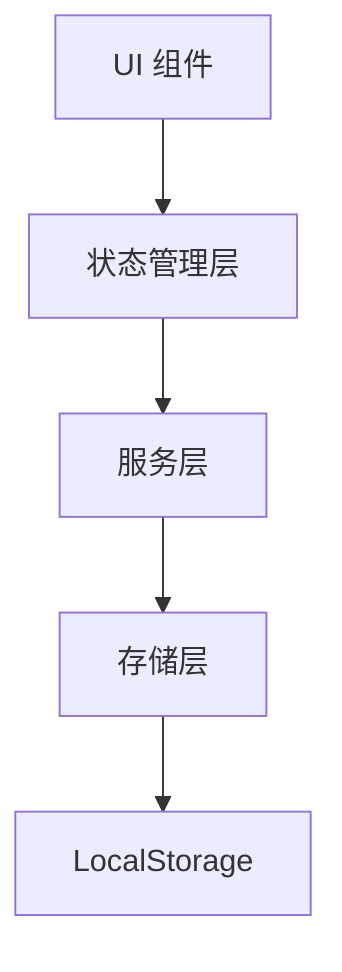
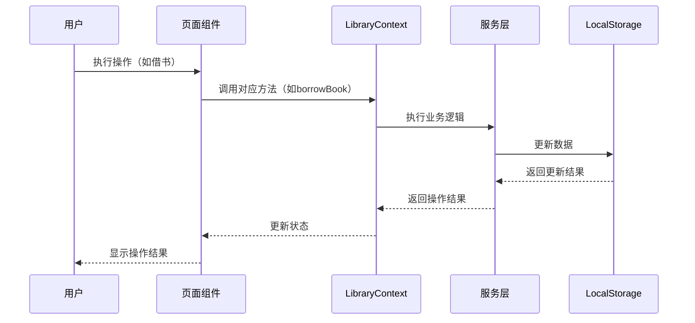

# LibraHub 项目代码审查报告

## 1. 仓库概览

LibraHub 是一个基于 React + TypeScript + Tailwind CSS 开发的智能图书管理系统，采用浏览器 LocalStorage 作为数据存储方案，可部署为静态网页。

- **核心功能**：书籍管理、会员管理、借阅归还、数据统计、数据备份恢复、系统设置
- **技术亮点**：模块化设计、类型安全、响应式 UI、完整的业务流程实现
- **应用场景**：中小型图书馆、学校图书室、企业资料室的日常管理

## 2. 目录结构

项目采用标准的 React + Vite 项目结构，代码组织清晰，模块划分合理。主要源代码位于 `src/` 目录，按功能模块进行组织：

```text
├── src/
│   ├── components/         # UI 组件
│   │   └── ui/             # 基础 UI 组件（Radix UI 封装）
│   ├── hooks/              # 自定义 Hooks
│   │   └── useLibrary.tsx  # 核心状态管理
│   ├── lib/                # 工具函数
│   ├── sections/           # 页面组件
│   ├── services/           # 服务层
│   │   └── storage.ts      # 数据存储服务
│   ├── types/              # TypeScript 类型定义
│   ├── App.tsx             # 应用入口
│   └── main.tsx            # 主渲染文件
├── package.json            # 项目依赖
└── tsconfig.json           # TypeScript 配置
```

**模块职责表**：

| 模块 | 主要职责 | 文件位置 | <mcfile>引用 |
| ---- | ------- | ------- | ----------- |
| 状态管理 | 全局状态管理和业务逻辑 | src/hooks/useLibrary.tsx | <mcfile name="useLibrary.tsx" path="src/hooks/useLibrary.tsx"></mcfile> |
| 数据存储 | 数据持久化和业务操作 | src/services/storage.ts | <mcfile name="storage.ts" path="src/services/storage.ts"></mcfile> |
| 页面组件 | 功能模块 UI 展示 | src/sections/ | <mcfile name="LibraryDashboard.tsx" path="src/sections/LibraryDashboard.tsx"></mcfile> |
| 基础组件 | UI 原子组件 | src/components/ui/ | <mcfile name="button.tsx" path="src/components/ui/button.tsx"></mcfile> |

## 3. 系统架构与主流程

LibraHub 采用经典的前端单页应用架构，结合 Context API 实现状态管理，LocalStorage 实现数据持久化。

### 架构层次



1. **UI 组件层**：由页面组件和基础 UI 组件组成，负责用户交互和数据展示
2. **状态管理层**：通过 `useLibrary` Hook 实现全局状态管理，处理业务逻辑
3. **服务层**：封装具体的业务操作，如书籍管理、会员管理、借阅管理等
4. **存储层**：负责数据的持久化存储和读取，基于 localStorage 实现

### 核心数据流

1. **初始化流程**：应用启动时，`LibraryProvider` 加载 localStorage 中的数据到内存状态
2. **业务操作流程**：用户操作 → UI 组件触发 action → 状态管理层处理 → 服务层执行业务逻辑 → 存储层更新数据 → 状态管理层更新内存状态 → UI 组件重渲染
3. **数据同步**：所有数据变更都会实时同步到 localStorage，确保数据持久化

### 主业务流程



## 4. 核心功能模块

### 4.1 书籍管理模块

**功能描述**：管理系统中的所有书籍信息，支持添加、编辑、删除、搜索等操作。

**核心功能**：
- 书籍基本信息管理（书名、作者、出版社等）
- 条形码管理（唯一标识）
- 库存管理（总库存、可借库存）
- 状态管理（可借阅、已借出、损坏等）
- 搜索和筛选（按关键词、分类、状态）

**实现细节**：
- 使用 `BookService` 处理书籍相关业务逻辑
- 支持条形码唯一性校验
- 自动计算借阅次数和库存状态
- 集成操作日志记录

**代码位置**：<mcfile name="storage.ts" path="src/services/storage.ts"></mcfile>（BookService 类）

### 4.2 会员管理模块

**功能描述**：管理图书馆会员信息，支持会员注册、类型设置、状态管理等功能。

**核心功能**：
- 会员基本信息管理（姓名、电话、身份证等）
- 会员类型管理（普通会员、VIP会员等）
- 会员状态管理（有效、过期、暂停等）
- 借阅权限管理（最大借阅数量、借阅期限）
- 搜索和筛选（按关键词、状态）

**实现细节**：
- 使用 `MemberService` 处理会员相关业务逻辑
- 使用 `MemberTypeService` 管理会员类型
- 支持会员卡号唯一性校验
- 自动计算当前借阅数量和到期日期

**代码位置**：<mcfile name="storage.ts" path="src/services/storage.ts"></mcfile>（MemberService 和 MemberTypeService 类）

### 4.3 借阅归还模块

**功能描述**：核心业务模块，处理书籍的借出、归还、续借等操作。

**核心功能**：
- 借书流程（验证会员、验证书籍、创建借阅记录）
- 还书流程（处理归还、计算逾期罚款、更新库存）
- 续借功能（延长借阅期限）
- 逾期管理（自动检测逾期、计算罚款）
- 借阅记录查询

**实现细节**：
- 使用 `BorrowService` 处理借阅相关业务逻辑
- 自动更新书籍和会员状态
- 支持逾期自动检测和状态更新
- 集成操作日志记录

**代码位置**：<mcfile name="storage.ts" path="src/services/storage.ts"></mcfile>（BorrowService 类）

### 4.4 数据概览模块

**功能描述**：提供图书馆运营数据的实时统计和可视化展示。

**核心功能**：
- 统计卡片（总藏书量、注册会员、当前借出等）
- 今日动态（今日借阅、今日归还、本月新会员）
- 数据可视化（图表展示）

**实现细节**：
- 在 `LibraryContext` 中计算统计数据
- 实时更新统计信息
- 支持多维度数据展示

**代码位置**：<mcfile name="useLibrary.tsx" path="src/hooks/useLibrary.tsx"></mcfile>（UPDATE_STATISTICS 处理逻辑）

### 4.5 数据管理模块

**功能描述**：提供系统数据的备份、恢复、清理功能，保障数据安全。

**核心功能**：
- 数据备份（导出为 JSON 文件）
- 数据恢复（从备份文件导入）
- 数据清理（清空所有数据）

**实现细节**：
- 使用 `StorageService` 处理数据导入导出
- 支持完整的数据备份和恢复
- 提供数据清理功能（带二次确认）

**代码位置**：<mcfile name="storage.ts" path="src/services/storage.ts"></mcfile>（StorageService 类）

### 4.6 系统设置模块

**功能描述**：配置图书馆基本信息和系统运行参数。

**核心功能**：
- 图书馆信息设置（名称、地址、电话等）
- 借阅规则设置（借阅天数、续借次数等）
- 逾期罚款设置（罚款金额、是否允许逾期借阅）

**实现细节**：
- 使用 `SettingsService` 处理系统设置
- 提供默认设置值
- 实时更新系统配置

**代码位置**：<mcfile name="storage.ts" path="src/services/storage.ts"></mcfile>（SettingsService 类）

## 5. 核心 API/类/函数

### 5.1 LibraryProvider

**功能**：全局状态管理提供者，封装所有业务逻辑和状态

**参数**：
- `children`：React 子组件

**返回值**：包含状态和方法的 Context Provider

**核心方法**：
- `addBook`：添加书籍
- `updateBook`：更新书籍信息
- `deleteBook`：删除书籍
- `addMember`：添加会员
- `updateMember`：更新会员信息
- `deleteMember`：删除会员
- `borrowBook`：处理借书业务
- `returnBook`：处理还书业务
- `renewBook`：处理续借业务
- `exportData`：导出所有数据
- `importData`：导入数据

**代码位置**：<mcfile name="useLibrary.tsx" path="src/hooks/useLibrary.tsx"></mcfile>

### 5.2 BookService

**功能**：处理书籍相关的所有业务逻辑

**核心方法**：
- `getAll()`：获取所有书籍
- `getById(id)`：根据 ID 获取书籍
- `getByBarcode(barcode)`：根据条形码获取书籍
- `search(params)`：搜索书籍
- `add(book)`：添加书籍
- `update(id, updates)`：更新书籍信息
- `delete(id)`：删除书籍
- `getStats()`：获取书籍统计信息

**代码位置**：<mcfile name="storage.ts" path="src/services/storage.ts"></mcfile>

### 5.3 MemberService

**功能**：处理会员相关的所有业务逻辑

**核心方法**：
- `getAll()`：获取所有会员
- `getById(id)`：根据 ID 获取会员
- `getByCardNumber(cardNumber)`：根据会员卡号获取会员
- `search(params)`：搜索会员
- `add(member)`：添加会员
- `update(id, updates)`：更新会员信息
- `delete(id)`：删除会员
- `getStats()`：获取会员统计信息

**代码位置**：<mcfile name="storage.ts" path="src/services/storage.ts"></mcfile>

### 5.4 BorrowService

**功能**：处理借阅相关的所有业务逻辑

**核心方法**：
- `getAll()`：获取所有借阅记录
- `getById(id)`：根据 ID 获取借阅记录
- `getCurrentBorrows()`：获取当前借阅中的记录
- `getOverdueBorrows()`：获取逾期未还的记录
- `borrow(params)`：处理借书业务
- `return(params)`：处理还书业务
- `renew(params)`：处理续借业务
- `getStats()`：获取借阅统计信息

**代码位置**：<mcfile name="storage.ts" path="src/services/storage.ts"></mcfile>

### 5.5 StorageService

**功能**：处理数据存储相关的通用操作

**核心方法**：
- `get(key, defaultValue)`：从 localStorage 获取数据
- `set(key, value)`：向 localStorage 存储数据
- `remove(key)`：从 localStorage 删除数据
- `exportAll()`：导出所有数据为 JSON 字符串
- `importAll(jsonData)`：从 JSON 字符串导入所有数据
- `clearAll()`：清空所有数据

**代码位置**：<mcfile name="storage.ts" path="src/services/storage.ts"></mcfile>

### 5.6 SettingsService

**功能**：处理系统设置相关的操作

**核心方法**：
- `get()`：获取系统设置
- `update(settings)`：更新系统设置

**代码位置**：<mcfile name="storage.ts" path="src/services/storage.ts"></mcfile>

## 6. 技术栈与依赖

| 技术/依赖 | 版本 | 用途 | 引用位置 |
| --------- | ---- | ---- | -------- |
| React | ^19.2.0 | 前端框架 | <mcfile name="package.json" path="package.json"></mcfile> |
| TypeScript | ~5.9.3 | 类型系统 | <mcfile name="package.json" path="package.json"></mcfile> |
| Tailwind CSS | ^3.4.19 | 样式框架 | <mcfile name="package.json" path="package.json"></mcfile> |
| Vite | ^7.2.4 | 构建工具 | <mcfile name="package.json" path="package.json"></mcfile> |
| Radix UI | 多个 | 基础组件库 | <mcfile name="package.json" path="package.json"></mcfile> |
| React Hook Form | ^7.70.0 | 表单管理 | <mcfile name="package.json" path="package.json"></mcfile> |
| Zod | ^4.3.5 | 数据验证 | <mcfile name="package.json" path="package.json"></mcfile> |
| Recharts | ^2.15.4 | 数据可视化 | <mcfile name="package.json" path="package.json"></mcfile> |
| Lucide React | ^0.562.0 | 图标库 | <mcfile name="package.json" path="package.json"></mcfile> |
| Vitest | ^4.0.18 | 测试框架 | <mcfile name="package.json" path="package.json"></mcfile> |

## 7. 关键模块与典型用例

### 7.1 借书流程

**功能说明**：处理会员借书业务，包括验证会员、验证书籍、创建借阅记录等步骤。

**配置与依赖**：
- 会员状态必须为 `active`
- 书籍状态必须为 `available` 且库存大于 0
- 会员当前借阅数量不能超过上限

**使用示例**：

```typescript
// 在组件中使用
import { useLibrary } from '@/hooks/useLibrary';

const { borrowBook } = useLibrary();

const handleBorrow = async () => {
  try {
    const record = await borrowBook({
      bookId: 'book_123',
      memberId: 'member_456',
      operator: '管理员'
    });
    console.log('借书成功', record);
  } catch (error) {
    console.error('借书失败', error);
  }
};
```

**常见问题与解决方案**：
- 会员状态异常：检查会员状态是否为 `active`
- 书籍不可借阅：检查书籍状态和库存
- 借阅数量超限：检查会员当前借阅数量是否已达上限

### 7.2 还书流程

**功能说明**：处理会员还书业务，包括更新借阅记录、计算逾期罚款、更新书籍和会员状态等步骤。

**配置与依赖**：
- 借阅记录状态必须为 `borrowed` 或 `overdue`
- 支持手动调整罚款金额

**使用示例**：

```typescript
// 在组件中使用
import { useLibrary } from '@/hooks/useLibrary';

const { returnBook } = useLibrary();

const handleReturn = async () => {
  try {
    const record = await returnBook({
      recordId: 'borrow_789',
      operator: '管理员',
      fineAmount: 5, // 可选，手动设置罚款金额
      fineReason: '逾期3天' // 可选，罚款原因
    });
    console.log('还书成功', record);
  } catch (error) {
    console.error('还书失败', error);
  }
};
```

### 7.3 数据备份与恢复

**功能说明**：提供系统数据的备份和恢复功能，保障数据安全。

**配置与依赖**：
- 备份文件格式为 JSON
- 恢复操作会覆盖现有数据

**使用示例**：

```typescript
// 在组件中使用
import { useLibrary } from '@/hooks/useLibrary';

const { exportData, importData } = useLibrary();

// 导出数据
const handleExport = () => {
  const data = exportData();
  // 下载备份文件
  const blob = new Blob([data], { type: 'application/json' });
  const url = URL.createObjectURL(blob);
  const a = document.createElement('a');
  a.href = url;
  a.download = `library_backup_${new Date().toISOString().slice(0, 19).replace(/[:T]/g, '-')}.json`;
  a.click();
  URL.revokeObjectURL(url);
};

// 导入数据
const handleImport = (file: File) => {
  const reader = new FileReader();
  reader.onload = (e) => {
    if (e.target?.result) {
      const result = importData(e.target.result as string);
      if (result) {
        console.log('数据导入成功');
      } else {
        console.error('数据导入失败');
      }
    }
  };
  reader.readAsText(file);
};
```

## 8. 配置、部署与开发

### 8.1 开发环境配置

**前置条件**：
- Node.js 18+
- npm 9+

**安装依赖**：
```bash
npm install
```

**启动开发服务器**：
```bash
npm run dev
```

**构建生产版本**：
```bash
npm run build
```

**运行测试**：
```bash
npm test
# 或运行测试并生成覆盖率报告
npm run test:coverage
```

**代码检查**：
```bash
npm run lint
```

### 8.2 部署方式

1. **静态网站部署**：
   - 构建生产版本：`npm run build`
   - 将 `dist` 目录部署到任何静态网站托管服务（如 Nginx、Apache、GitHub Pages、Vercel 等）

2. **容器化部署**：
   - 创建 Dockerfile：
     ```dockerfile
     FROM nginx:alpine
     COPY dist/ /usr/share/nginx/html
     EXPOSE 80
     ```
   - 构建镜像：`docker build -t librahub .`
   - 运行容器：`docker run -p 8080:80 librahub`

### 8.3 环境变量

项目目前使用 localStorage 作为数据存储，无需配置环境变量。未来如需集成后端 API，可通过环境变量配置 API 地址。

## 9. 监控与维护

### 9.1 数据监控

- **操作日志**：系统自动记录所有关键操作，包括书籍管理、会员管理、借阅操作等
- **统计数据**：实时监控图书馆运营数据，包括总藏书量、会员数量、借阅情况等
- **逾期提醒**：自动检测逾期未还的书籍，提供逾期提醒功能

### 9.2 常见问题与解决方案

| 问题 | 可能原因 | 解决方案 |
| ---- | ------- | ------- |
| 存储空间不足 | localStorage 容量限制（约 5-10MB） | 定期备份数据并清理旧数据，或考虑迁移到 IndexedDB |
| 数据丢失 | 浏览器清除缓存或本地存储 | 定期备份数据，启用自动备份功能 |
| 借阅记录状态错误 | 系统时间偏差 | 检查系统时间设置，确保自动逾期检测正常运行 |
| 搜索性能下降 | 数据量过大 | 优化搜索算法，考虑使用防抖和节流技术 |

### 9.3 维护建议

- **定期备份**：建议每周至少备份一次数据
- **数据清理**：定期清理过期的借阅记录和日志
- **系统更新**：及时更新依赖包，确保系统安全
- **性能优化**：当数据量较大时，考虑使用 IndexedDB 替代 localStorage

## 10. 总结与亮点回顾

LibraHub 是一个功能完整、设计合理的智能图书管理系统，具有以下亮点：

### 10.1 技术亮点

1. **模块化设计**：采用清晰的模块化架构，代码组织合理，易于维护和扩展
2. **类型安全**：全面使用 TypeScript，提供完整的类型定义，减少运行时错误
3. **响应式 UI**：基于 Tailwind CSS 实现响应式设计，适配不同屏幕尺寸
4. **状态管理**：使用 React Context + useReducer 实现全局状态管理，逻辑清晰
5. **数据持久化**：基于 localStorage 实现数据持久化，无需后端服务
6. **完整的业务流程**：实现了图书管理系统的完整业务流程，包括书籍管理、会员管理、借阅归还等
7. **操作日志**：集成操作日志记录，便于追踪系统操作历史
8. **数据可视化**：使用 Recharts 实现数据可视化，直观展示运营数据

### 10.2 功能亮点

1. **完整的书籍管理**：支持书籍基本信息、库存、状态的全面管理
2. **灵活的会员系统**：支持多种会员类型，不同的借阅权限和期限
3. **智能的借阅管理**：自动处理借书、还书、续借业务，支持逾期检测和罚款计算
4. **强大的数据统计**：提供实时的运营数据统计和可视化展示
5. **安全的数据管理**：支持完整的数据备份和恢复功能
6. **可配置的系统设置**：灵活配置图书馆信息和借阅规则
7. **扫码支持**：预留扫码枪接口，支持条形码快速识别

### 10.3 应用价值

LibraHub 适用于中小型图书馆、学校图书室、企业资料室等场景，具有以下应用价值：

1. **降低管理成本**：自动化管理流程，减少人工操作
2. **提高运营效率**：快速处理借还书业务，减少排队等待时间
3. **提升服务质量**：提供更便捷的借阅体验，增强用户满意度
4. **数据驱动决策**：基于实时统计数据，优化图书馆运营策略
5. **易于部署和维护**：作为静态网页部署，无需复杂的服务器配置

### 10.4 未来发展建议

1. **后端集成**：考虑开发后端 API，使用数据库存储数据，支持多用户同时访问
2. **移动端适配**：开发配套移动 App，支持随时随地管理图书馆
3. **自助服务**：实现会员自助借还书功能，减少管理员工作量
4. **智能推荐**：基于借阅历史，为会员推荐相关书籍
5. **多语言支持**：添加多语言支持，扩大系统适用范围
6. **云存储集成**：支持将数据备份到云端，提高数据安全性

LibraHub 是一个设计精良、功能完整的图书管理系统，通过现代化的前端技术栈实现了传统图书馆管理系统的核心功能，同时具备良好的扩展性和可维护性。系统采用的模块化设计和类型安全的开发方式，为未来的功能扩展和技术升级奠定了坚实的基础。