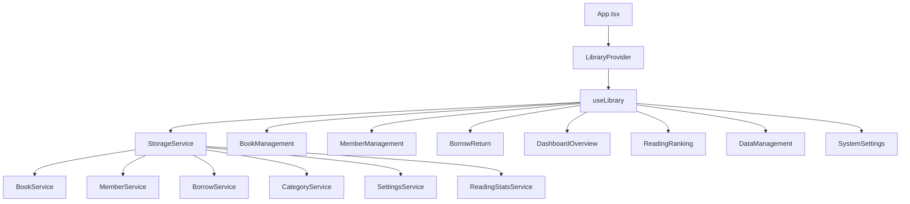

# LibraHub Code Wiki

## 1. Project Overview

LibraHub is a modern, single-page library management system built with React, TypeScript, and Vite. It provides a comprehensive solution for managing library operations including book management, member management, borrow/return processes, and reading statistics.

### Key Features
- **Book Management**: Add, edit, delete books with barcode scanning and ISBN auto-fill
- **Member Management**: Manage members, member types, and member groups
- **Borrow/Return System**: Track book checkouts, returns, renewals, and overdue items
- **Reading Statistics**: Track reading progress and generate leaderboards
- **Data Management**: Import/export data for backup and restore
- **Dashboard**: Overview of library statistics and quick access to core functions

### Technology Stack
- **Frontend Framework**: React 19.2.0 + TypeScript 5.9.3
- **Build Tool**: Vite 7.2.4
- **Styling**: Tailwind CSS 3.4.19
- **UI Components**: Radix UI, Lucide Icons
- **Charts**: Recharts
- **State Management**: React Context API with useReducer
- **Data Storage**: localStorage (persistence layer)

## 2. Project Structure

```
LibraHub/
├── src/
│   ├── components/          # Reusable UI components
│   ├── hooks/               # Custom React hooks
│   ├── lib/                 # Utility functions
│   ├── sections/            # Main application sections
│   ├── services/            # Data services
│   ├── test/                # Test utilities
│   ├── types/               # TypeScript type definitions
│   ├── App.tsx              # Main application component
│   └── main.tsx             # Application entry point
├── public/                  # Static assets
├── e2e/                     # End-to-end tests
└── dist/                    # Build output
```

### Directory Breakdown

| Directory       | Purpose                                           | Key Files                                                                 |
|-----------------|---------------------------------------------------|--------------------------------------------------------------------------|
| `components/`   | Reusable UI components                            | [OperatorPasswordModal.tsx](file:///workspace/LibraHub/src/components/OperatorPasswordModal.tsx), [SetPasswordModal.tsx](file:///workspace/LibraHub/src/components/SetPasswordModal.tsx) |
| `hooks/`        | Custom React hooks for state management           | [useLibrary.tsx](file:///workspace/LibraHub/src/hooks/useLibrary.tsx), [useStorageMonitor.tsx](file:///workspace/LibraHub/src/hooks/useStorageMonitor.tsx) |
| `lib/`          | Utility functions                                 | [utils.ts](file:///workspace/LibraHub/src/lib/utils.ts)                  |
| `sections/`     | Main application sections/pages                   | [BookManagement.tsx](file:///workspace/LibraHub/src/sections/BookManagement.tsx), [BorrowReturn.tsx](file:///workspace/LibraHub/src/sections/BorrowReturn.tsx), [DashboardOverview.tsx](file:///workspace/LibraHub/src/sections/DashboardOverview.tsx), [MemberManagement.tsx](file:///workspace/LibraHub/src/sections/MemberManagement.tsx) |
| `services/`     | Data services and storage operations              | [storage.ts](file:///workspace/LibraHub/src/services/storage.ts), [isbn.ts](file:///workspace/LibraHub/src/services/isbn.ts), [operator.ts](file:///workspace/LibraHub/src/services/operator.ts) |
| `types/`        | TypeScript type definitions                       | [index.ts](file:///workspace/LibraHub/src/types/index.ts)                |

## 3. Core Architecture

### State Management

LibraHub uses React Context API with useReducer for state management, implemented through the `useLibrary` hook. This provides a centralized state store for the entire application.

```typescript
// State structure
interface LibraryState {
  books: Book[];
  members: Member[];
  memberTypes: MemberType[];
  borrowRecords: BorrowRecord[];
  categories: BookCategory[];
  settings: SystemSettings;
  statistics: Statistics;
  loading: boolean;
  error: string | null;
}
```

### Data Flow

1. **UI Components** trigger actions through the `useLibrary` hook
2. **Actions** are dispatched to the reducer
3. **Reducer** updates the state based on the action type
4. **Services** handle data persistence (localStorage operations)
5. **State updates** are reflected in the UI

### Data Storage

The application uses localStorage for data persistence through the `StorageService` class. This provides a simple way to store data without a backend, while also allowing for easy migration to IndexedDB or a backend API in the future.

## 4. Key Modules

### 4.1 Book Management

The Book Management module handles all operations related to books, including adding, editing, deleting, and searching for books. It also supports barcode scanning and ISBN auto-fill functionality.

#### Key Functions
- `addBook`: Add a new book to the library
- `updateBook`: Update existing book information
- `deleteBook`: Remove a book from the library
- `searchBooks`: Search books by various criteria
- `getBookByBarcode`: Find a book by its barcode

#### Usage Example
```typescript
const { addBook } = useLibrary();

const handleAddBook = async (bookData) => {
  try {
    await addBook(bookData);
    // Success handling
  } catch (error) {
    // Error handling
  }
};
```

### 4.2 Member Management

The Member Management module handles member-related operations, including adding, editing, and deleting members, as well as managing member types and groups.

#### Key Functions
- `addMember`: Add a new member to the library
- `updateMember`: Update existing member information
- `deleteMember`: Remove a member from the library
- `searchMembers`: Search members by various criteria
- `getMemberByCardNumber`: Find a member by their card number

### 4.3 Borrow/Return Management

The Borrow/Return module handles the checkout and return processes for books, including renewals and tracking overdue items.

#### Key Functions
- `borrowBook`: Check out a book to a member
- `returnBook`: Process the return of a book
- `renewBook`: Renew a borrowed book
- `getOverdueBorrows`: Get a list of overdue books

### 4.4 Reading Statistics

The Reading Statistics module tracks reading progress and generates leaderboards to encourage reading engagement.

#### Key Functions
- `updateStats`: Update reading statistics for a member
- `getTotalRanking`: Get overall reading rankings
- `getGroupRanking`: Get group-based reading rankings
- `getMonthlyRanking`: Get monthly reading rankings

### 4.5 Data Management

The Data Management module handles data import/export operations for backup and restore purposes.

#### Key Functions
- `exportData`: Export all library data as JSON
- `importData`: Import library data from JSON

## 5. Core Classes and Functions

### 5.1 StorageService

The base storage service that handles localStorage operations.

**Key Methods**:
- `get<T>(key: string, defaultValue: T): T` - Get data from localStorage
- `set<T>(key: string, value: T): void` - Save data to localStorage
- `exportAll(): string` - Export all data as JSON
- `importAll(jsonData: string): boolean` - Import data from JSON

### 5.2 BookService

Handles book-related operations.

**Key Methods**:
- `getAll(): Book[]` - Get all books
- `getById(id: string): Book | undefined` - Get a book by ID
- `getByBarcode(barcode: string): Book | undefined` - Get a book by barcode
- `add(book: Omit<Book, 'id' | 'createdAt' | 'updatedAt' | 'borrowCount'>): Book` - Add a new book
- `update(id: string, updates: Partial<Book>): Book | null` - Update a book
- `delete(id: string): boolean` - Delete a book
- `search(params: BookSearchParams): Book[]` - Search books

### 5.3 MemberService

Handles member-related operations.

**Key Methods**:
- `getAll(): Member[]` - Get all members
- `getById(id: string): Member | undefined` - Get a member by ID
- `getByCardNumber(cardNumber: string): Member | undefined` - Get a member by card number
- `add(member: Omit<Member, 'id' | 'createdAt' | 'updatedAt' | 'currentBorrowCount' | 'totalReadingWords'>): Member` - Add a new member
- `update(id: string, updates: Partial<Member>): Member | null` - Update a member
- `delete(id: string): boolean` - Delete a member

### 5.4 BorrowService

Handles borrow/return operations.

**Key Methods**:
- `borrow(params: { bookId: string; memberId: string; operator: string; notes?: string }): BorrowRecord` - Check out a book
- `return(params: { recordId: string; operator: string; fineAmount?: number; fineReason?: string }): BorrowRecord` - Return a book
- `renew(params: { recordId: string; operator: string }): BorrowRecord` - Renew a book
- `getOverdueBorrows(): BorrowRecord[]` - Get overdue books

### 5.5 ReadingStatsService

Handles reading statistics operations.

**Key Methods**:
- `updateStats(memberId: string, memberName: string, groupId: string | undefined, yearMonth: string, wordCount: number): ReadingStats` - Update reading stats
- `getTotalRanking(): Array<{ memberId: string; memberName: string; groupId?: string; groupName?: string; totalWords: number; bookCount: number }>` - Get total rankings
- `getGroupRanking(): Array<{ groupId: string; groupName: string; totalWords: number; memberCount: number; avgWords: number }>` - Get group rankings

## 6. Data Models

### 6.1 Book

```typescript
interface Book {
  id: string;
  barcode: string;              // 条形码（必备）
  isbn: string;                 // ISBN号
  title: string;                // 书名（必备）
  subtitle?: string;            // 副标题
  author: string;               // 作者（必备）
  translator?: string;          // 译者
  publisher: string;            // 出版社
  publishDate?: string;         // 出版日期
  edition?: string;             // 版次
  categoryId: string;           // 分类ID
  categoryName?: string;        // 分类名称
  language?: string;            // 语言
  wordCount?: number;           // 字数
  pageCount?: number;           // 页数
  price?: number;               // 定价
  description?: string;         // 简介
  cover?: string;               // 封面图片
  location?: string;            // 馆藏位置
  status: BookStatus;           // 状态
  totalStock: number;           // 总库存
  availableStock: number;       // 可借库存
  borrowCount: number;          // 借阅次数
  createdAt: string;
  updatedAt: string;
}
```

### 6.2 Member

```typescript
interface Member {
  id: string;
  cardNumber: string;           // 会员卡号（条形码）
  name: string;                 // 姓名
  gender?: 'male' | 'female' | 'other';
  phone: string;                // 电话
  email?: string;               // 邮箱
  address?: string;             // 地址
  idCard?: string;              // 身份证号
  birthDate?: string;           // 出生日期
  memberType: MemberType;       // 会员类型
  status: MemberStatus;         // 状态
  registerDate: string;         // 注册日期
  expireDate: string;           // 到期日期
  maxBorrowCount: number;       // 最大借阅数量
  currentBorrowCount: number;   // 当前借阅数量
  deposit?: number;             // 押金
  notes?: string;               // 备注
  groupId?: string;             // 所属分组ID
  totalReadingWords: number;    // 累计阅读字数
  badges?: MemberBadge[];       // 个人获得的徽章
  achievements?: Achievement[]; // 个人成就
  createdAt: string;
  updatedAt: string;
}
```

### 6.3 BorrowRecord

```typescript
interface BorrowRecord {
  id: string;
  bookId: string;               // 书籍ID
  bookBarcode: string;          // 书籍条形码
  bookTitle: string;            // 书名
  bookAuthor: string;           // 作者
  memberId: string;             // 会员ID
  memberCardNumber: string;     // 会员卡号
  memberName: string;           // 会员姓名
  borrowDate: string;           // 借阅日期
  dueDate: string;              // 应还日期
  returnDate?: string;          // 实际归还日期
  status: BorrowStatus;         // 状态
  renewCount: number;           // 续借次数
  fineAmount: number;           // 罚款金额
  fineReason?: string;          // 罚款原因
  notes?: string;               // 备注
  operator: string;             // 操作员
  wordCount?: number;           // 阅读字数（归还时记录）
  readingYearMonth?: string;    // 阅读月份（归还时记录，格式：YYYY-MM）
  wordCountInputAt?: string;    // 字数录入时间（如果归还时手动录入）
  createdAt: string;
  updatedAt: string;
}
```

### 6.4 BookCategory

```typescript
interface BookCategory {
  id: string;
  name: string;
  code: string;
  parentId?: string;
  description?: string;
  createdAt: string;
  updatedAt: string;
}
```

### 6.5 MemberType

```typescript
interface MemberType {
  id: string;
  name: string;                 // 类型名称（如：普通会员、VIP会员）
  durationMonths: number;       // 有效期（月）
  maxBorrowCount: number;       // 最大借阅数量
  maxBorrowDays: number;        // 最大借阅天数
  renewTimes: number;           // 可续借次数
  renewDays: number;            // 续借天数
  depositAmount: number;        // 押金金额
  fee: number;                  // 会费
  description?: string;
  createdAt: string;
  updatedAt: string;
}
```

## 7. Dependency Relationships



## 8. Running the Project

### 8.1 Development Mode

```bash
# Install dependencies (if not already installed)
npm install

# Start development server
npm run dev
```

The application will be available at http://localhost:5173

### 8.2 Production Build

```bash
# Build for production
npm run build

# Preview production build
npm run preview
```

The application will be available at http://localhost:4173

### 8.3 Testing

```bash
# Run unit tests
npm run test:run

# Run end-to-end tests
npm run test:e2e

# Run all tests
npm run test:all
```

## 9. Key Features and Workflows

### 9.1 Book Management Workflow

1. **Add Book**: Fill out book details or use ISBN auto-fill
2. **Edit Book**: Update existing book information
3. **Delete Book**: Remove a book (only if no active borrows)
4. **Search Books**: Find books by keyword, category, or status
5. **Barcode Scanning**: Use barcode scanner to quickly add or find books

### 9.2 Borrow/Return Workflow

1. **Borrow Book**: Select book and member, process checkout
2. **Return Book**: Scan book barcode, process return
3. **Renew Book**: Extend due date for borrowed books
4. **Overdue Management**: Track and manage overdue items

### 9.3 Member Management Workflow

1. **Add Member**: Create new member with member type
2. **Edit Member**: Update member information
3. **Delete Member**: Remove member (only if no active borrows)
4. **Member Groups**: Organize members into groups for better management

### 9.4 Reading Statistics Workflow

1. **Track Reading**: Automatically track reading progress when books are returned
2. **View Rankings**: Check individual and group reading leaderboards
3. **Monthly Stats**: View monthly reading statistics

## 10. Customization and Extension

### 10.1 Data Storage

The current implementation uses localStorage for data persistence. To extend to other storage options:

1. **IndexedDB**: Modify `StorageService` to use IndexedDB for larger datasets
2. **Backend API**: Create API endpoints and update services to use fetch/axios

### 10.2 UI Customization

- **Theming**: Update Tailwind CSS configuration in `tailwind.config.js`
- **Components**: Add or modify components in the `components/` directory
- **Layout**: Adjust the main layout in `LibraryDashboard.tsx`

### 10.3 Feature Extensions

- **Reservations**: Implement book reservation system
- **Notifications**: Add email or SMS notifications for due dates
- **Reports**: Generate detailed library usage reports
- **Online Catalog**: Create a public-facing catalog for patrons

## 11. Troubleshooting

### 11.1 Common Issues

| Issue | Possible Cause | Solution |
|-------|---------------|----------|
| Port 5173 is occupied | Another process is using the port | Close the other process or modify port in vite.config.ts |
| Dependency installation fails | Corrupted node_modules | Run `rm -rf node_modules package-lock.json && npm install` |
| Build fails | TypeScript errors | Run `npx tsc --noEmit` to check for errors |
| Data import fails | Invalid JSON format | Ensure the JSON file is properly formatted |

### 11.2 Browser Compatibility

LibraHub is designed to work with modern browsers that support ES6+ features. For optimal performance, use:
- Chrome 60+
- Firefox 55+
- Safari 12+
- Edge 79+

## 12. Contributing

### 12.1 Development Guidelines

- Follow TypeScript best practices
- Use functional components with hooks
- Follow Tailwind CSS naming conventions
- Write unit tests for new features
- Document code changes

### 12.2 Code Style

- Use 2 spaces for indentation
- Use single quotes for strings
- Use camelCase for variables and functions
- Use PascalCase for components and interfaces
- Add JSDoc comments for public APIs

## 13. Conclusion

LibraHub is a comprehensive library management system that provides all the essential features needed for a small to medium-sized library. Its modular architecture and use of modern web technologies make it easy to maintain and extend.

With its intuitive interface, robust feature set, and flexible data storage options, LibraHub is an excellent solution for managing library operations efficiently.

---

*This documentation is automatically generated and should be updated as the project evolves.*